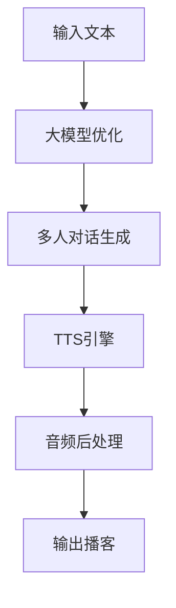

# d.va
> D.Va拥有一部强大的机甲，它具有两台全自动的近距离聚变机炮、可以使机甲飞跃敌人或障碍物的推进器、 还有可以抵御来自正面的远程攻击的防御矩阵

—— From [OverWatch](http://ow.blizzard.cn/heroes/dva)

## 项目简介

D.VA 是一个基于大模型优化的端到端多人TTS引擎，专注于播客节目创作。项目的目标是让AI辅助创作变得简单而有趣。

### 核心特性

- 🎯 端到端的多人TTS引擎
- 🤖 基于大模型的对话优化
- 🎙️ 自然的多人对话场景
- 🎭 丰富的音色库支持
- ⚡ 实时语音合成

### 技术架构

## 应用场景

构建一个可以每日更新语音版新闻的助手，然后自动推送到播客和小红书涨粉。

### 目标
1. 有用 - 为用户提供优质的播客内容
2. 涨粉 - 通过优质内容获取稳定受众

### 实现路径
1. 每日获取不同领域的专业新闻
2. 讲新闻分解成新闻稿
3. 新闻稿变成语音稿件 （带片头片尾曲，时长不超过4分钟）
4. 自动推送到小红书和播客

## 演示
双人播客内容第一版:

<audio controls>
  <source src="assets/ai_podcast_v1.MP3" type="audio/mpeg">
  你的浏览器不支持音频播放。
</audio>

